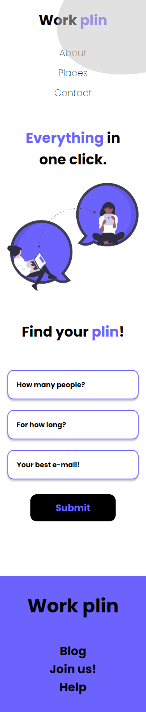
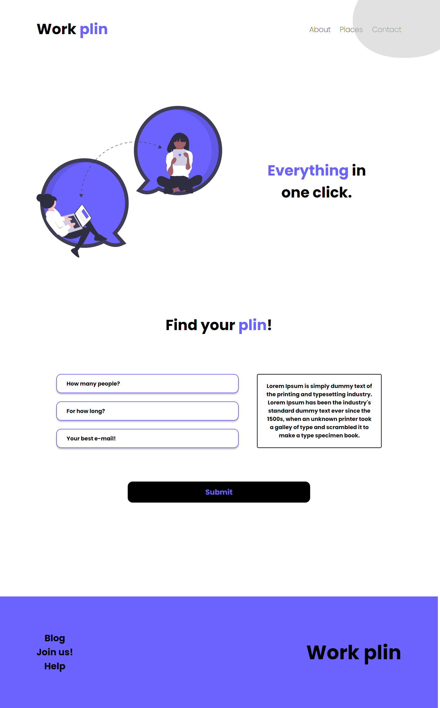

# DevChallenge - Work Plin - Landing Page challenge

This is a solution to the [Work Plin - Landing Page challenge on DevChallenge](https://devchallenge-v2.vercel.app/details/f8f60f82-ef9d-44e8-895e-5fe73c3c33c7).

## Table of contents

- [Overview](#overview)
  - [The challenge](#the-challenge)
  - [Screenshot](#screenshot)
  - [Live site](#links)
- [My process](#my-process)
  - [Built with](#built-with)
- [Author](#author)

## Overview

### The challenge

The challenge was to build a landing page for a coworking space.

### Requirements

- The page should look as close as possible to the visual design.
- The page should be responsive

### Screenshot

  
Mobile version

  

  
Desktop version

  

### Live site

- [Preview](https://alberto-rj.github.io/work-plin/)

## My process

### Built with

- Semantic HTML5 markup
- CSS custom properties
- CSS Flexbox
- Mobile-first workflow

## Author

- GitHub - [Alberto Raúl José](https://www.github.com/alberto-rj)
- Twitter - [@albertorauljose](https://www.twitter.com/albertorauljose)
